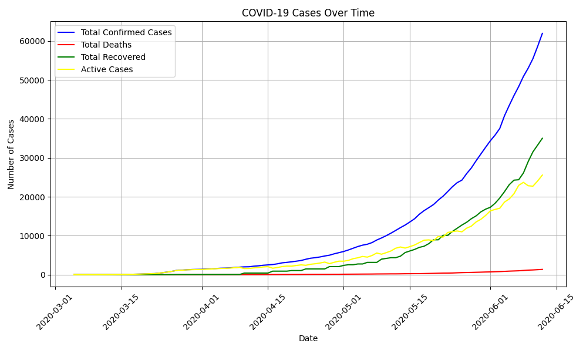
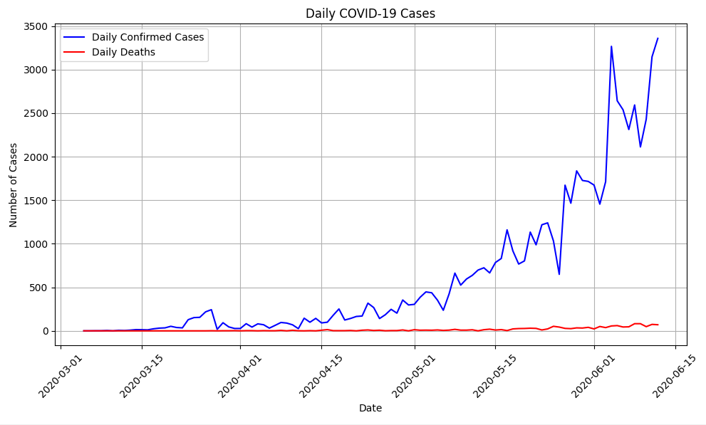

# Covid19_Data_Visualization
This Python project visualizes trends in confirmed cases, deaths, recovered cases, and active cases over time, along with daily confirmed cases and daily deaths, from a COVID-19 JSON dataset.

# Installation
Download and install Python - The code is written for Python 3
install matplotlib library - This library is used for creating the visualizations

# Running the Script
Open a terminal, navigate to the script's directory, and run: python covid_data_visualization.py

# Code Explanation

1. load_covid_data(filename) Function:
    - This function takes a filename as input (JSON file).
    - It opens the file in read mode ('r').
    - Read the JSON data into a Python dictionary.
    - Calls process_data function to further process the loaded data and returns the result.

2. process_data(data) Function:
    This function takes a dictionary containing COVID-19 data as input.
    It initializes empty lists 
    It iterates through each entry in the data dictionary.
    For each entry:
    It uses datetime.strptime(entry['Date'], '%Y/%m/%d') to convert the date string in the format "YYYY/MM/DD" to a datetime object and appends it to the dates list.
    It calls the convert_to_int function to handle potential string values for cases, deaths, and recovered data before appending them to their respective lists.
    Finally, it returns a dictionary containing the processed lists

 3. convert_to_int(value) Function:
    This function takes a value as input.
    It checks if the value is a string
    If it's a string:
    It converts the string to an integer using int(value.replace(" ", "")). This removes any spaces before the string conversion, handling potential formatting issues in the data.
    If the conversion fails (ValueError), it returns the original value to avoid data loss.
    If the value is not a string, it simply returns the value as is.

4. plot_covid_data(data) Function:
    This function takes a dictionary containing lists of data
    It uses plt.figure(figsize=(10, 6)) to create a plot figure with a specific size (10 inches wide, 6 inches high).
    It creates  line plots using plt.plot:
    Confirmed cases (blue)
    Deaths (red)
    Recovered cases (green)
    Active cases(yellow)
    The function sets labels for the x-axis (Date), y-axis (Number of Cases), and adds a title ("COVID-19 Cases Over Time").
    It rotates x-axis labels by 45 degrees for better readability using plt.xticks(rotation=45).
    It enables grid lines for the plot using plt.grid(True).
    It adds a legend to differentiate the lines using plt.legend().
    Finally, it adjusts the layout using plt.tight_layout() and displays the plot using plt.show().

5. plot_daily_data(data) Function:
    it does the same things as plot_covid_data(data) Function but for daily cases

6. Main Program:
    The code uses an if __name__ == '__main__': block to ensure the following code only runs when the script is executed.
    Inside this block:
    It calls load_covid_data("covid.json") to load the COVID-19 data from the "covid.json" file.
    The loaded data is stored in the covid_data variable.
    It calls plot_covid_data(covid_data) to generate the plot using the loaded data.
    It calls plot_daily_data(covid_data) to generate the plot using the loaded data

# Total Covid Data

# Daily covid Data
